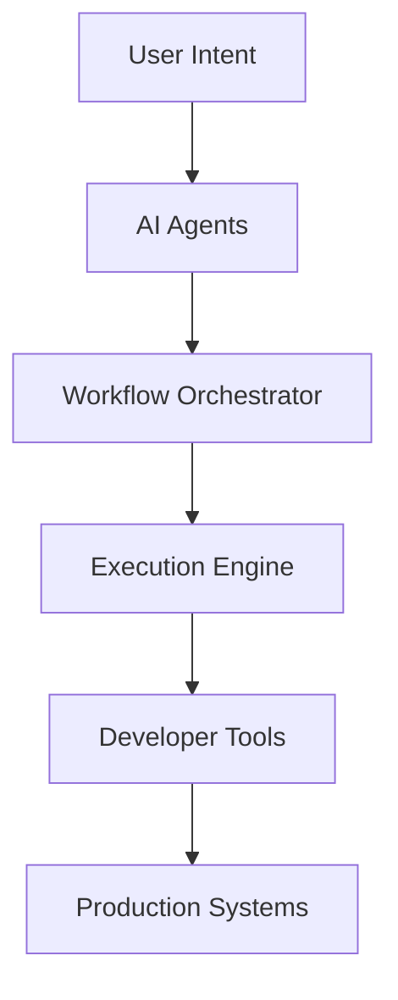

<div align="center">

# ⚡ Ali Ihtsham


<p>
  
  
  
</p>

</div>

---

# 🚀 Mission

> Building developer operating systems where AI agents, tooling, infrastructure, and workflows collaborate autonomously.



---

# 🧠 Founder Profile

I build systems, not features.

My focus is creating infrastructure that compounds engineering output through:

- Multi-Agent Architectures
- Autonomous Development Systems
- Developer Tooling Platforms
- AI Workflow Orchestration
- Frontend Acceleration Infrastructure
- Production-Grade AI Applications

---

# ⚔️ Core Domains

<table>
<tr>
<td width="50%">

### AI Systems

- Agent Orchestration
- RAG Pipelines
- Tool Calling
- Workflow Intelligence
- OpenAI Ecosystems

</td>

<td width="50%">

### Developer Infrastructure

- VS Code Extensions
- Internal Platforms
- CI/CD Systems
- Engineering Automation
- Developer Experience

</td>
</tr>
</table>

---

# 🛠 Tech Arsenal

### Frontend


### Backend


### AI


### Infrastructure


---

# 🏗 System Architecture

```text
┌─────────────────────────────────────────────┐
│          AI Developer Operating System      │
├─────────────────────────────────────────────┤
│ Intelligence Layer                          │
│ Agents • RAG • Tool Calling • Planning      │
├─────────────────────────────────────────────┤
│ Execution Layer                             │
│ APIs • Workers • Automation Pipelines       │
├─────────────────────────────────────────────┤
│ Interface Layer                             │
│ React • Next.js • VS Code Extensions        │
└─────────────────────────────────────────────┘
```

---

# 🚀 Flagship Projects

## NativeFlow

AI-powered VS Code acceleration platform.

**Capabilities**

- Smart scaffolding
- Component generation
- Workflow automation
- Developer productivity systems

---

## Agent Organization System

```text
CEO Agent
 └─ CTO Agent
      ├─ Frontend Agent
      ├─ Backend Agent
      ├─ DevOps Agent
      └─ QA Agent
```

Autonomous engineering execution architecture.

---

## Code Brand Studio

Premium engineering-focused web experiences.

- Motion-first UI
- Portfolio systems
- High-performance architecture
- Brand-grade frontend engineering

---

# 📊 GitHub Intelligence

<div align="center">


</div>

---

# 📈 Contribution Graph

<div align="center">


</div>

---

# 🌍 Current Focus

```yaml
building:
  - AI Developer Operating Systems
  - Autonomous Agent Networks
  - Developer Infrastructure Products

researching:
  - Multi-Agent Coordination
  - AI Workflow Compression
  - Developer Experience Systems

goal:
  Build systems that multiply engineering output.
```

---

# 🤝 Connect

<p align="center">
<a href="https://github.com/aliihtsham-debug">

</a>

<a href="https://linkedin.com/in/aliihtsham">

</a>

<a href="mailto:aliihtsham34@gmail.com">

</a>
</p>

---

<div align="center">

### "Systems that scale are built. Systems that compound are engineered."

</div>